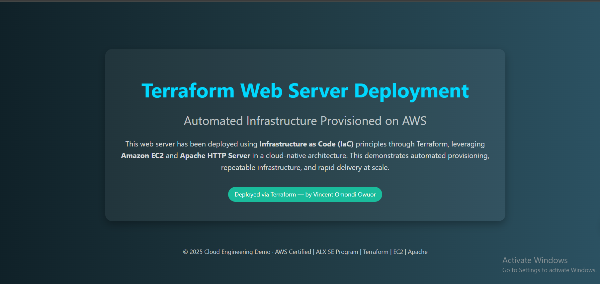
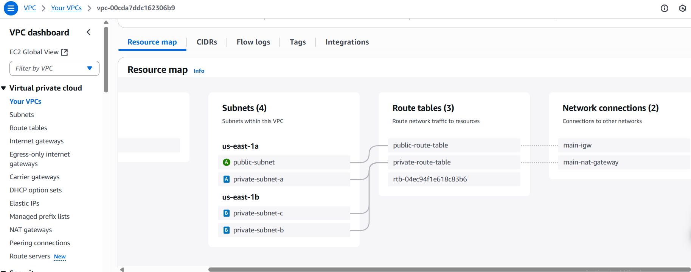
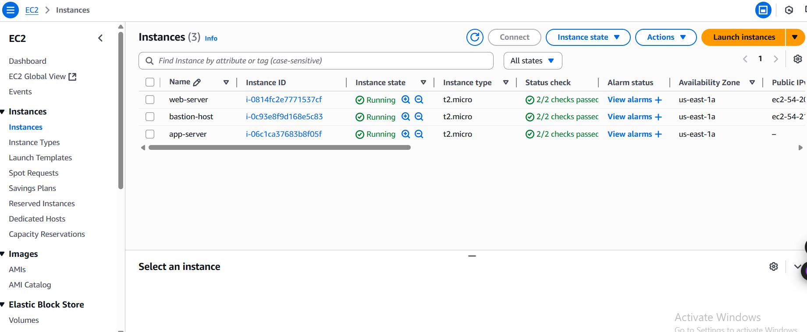
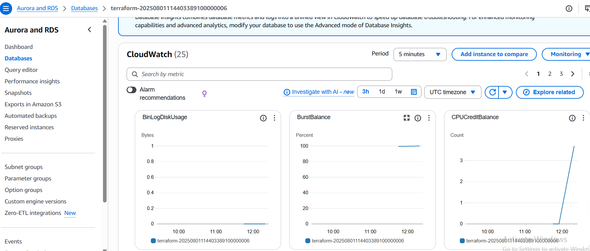
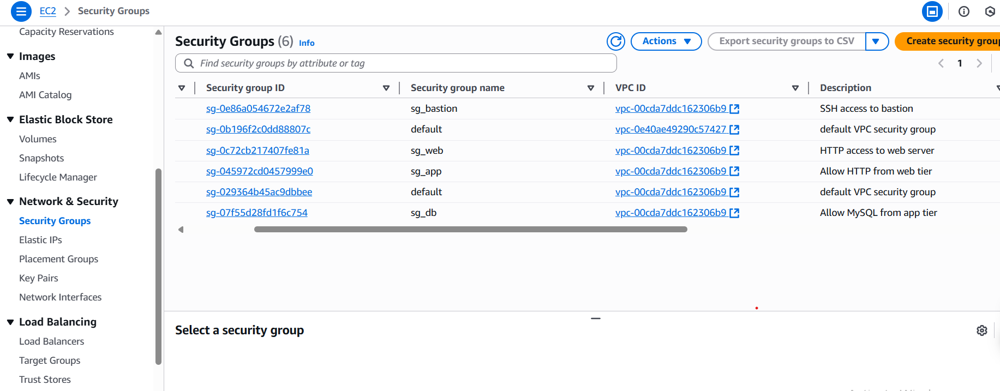

# Terraform AWS 3-Tier Web Infrastructure

[](https://www.terraform.io/)
[](https://aws.amazon.com/)

A complete AWS 3-tier web architecture deployed using Terraform Infrastructure as Code (IaC). This project demonstrates best practices for building scalable, secure, and highly available web applications on AWS.

## Architecture Overview

This infrastructure implements a classic 3-tier architecture:


- **Presentation Tier**: Web servers in public subnets
- **Application Tier**: App servers in private subnets  
- **Data Tier**: RDS MariaDB in private subnets

## Visual Infrastructure Showcase

### Live Web Application


### AWS Console Views
<table>
<tr>
<td width="50%">

**VPC Network Architecture**


</td>
<td width="50%">

**Running EC2 Instances**


</td>
</tr>
<tr>
<td width="50%">

**RDS Database Instance**


</td>
<td width="50%">

**Security Groups Configuration**


</td>
</tr>
</table>

### Key Features

- **High Availability**: Multi-AZ deployment across 2 availability zones  
- **Security**: Network segmentation with security groups  
- **Scalability**: Designed for horizontal scaling  
- **Infrastructure as Code**: Complete Terraform automation  
- **Best Practices**: Following AWS Well-Architected Framework  

## Infrastructure Components

### Networking
- **VPC**: Custom VPC with DNS support
- **Subnets**: 1 public + 3 private subnets across 2 AZs
- **Internet Gateway**: Public internet access
- **NAT Gateway**: Private subnet internet access
- **Route Tables**: Proper routing configuration

### Compute
- **Bastion Host**: Secure access to private resources
- **Web Server**: Apache HTTP server with custom landing page
- **App Server**: Application tier with MariaDB client

### Database
- **RDS MariaDB**: Managed database service
- **Multi-AZ**: High availability configuration
- **Security**: Private subnet deployment

### Security
- **Security Groups**: Least privilege access control
- **Network ACLs**: Additional network-level security
- **SSH Key Management**: Secure instance access

## Quick Start

### Prerequisites
- [Terraform](https://www.terraform.io/downloads.html) v1.0+
- [AWS CLI](https://aws.amazon.com/cli/) configured
- AWS account with appropriate permissions
- SSH key pair for EC2 access

### Deployment

1. **Clone the repository**
   ```bash
   git clone https://github.com/owuorviny109/terraform-aws-web-tier-infra.git
   cd terraform-aws-web-tier-infra
   ```

2. **Configure variables**
   ```bash
   cp variables.tf terraform.tfvars
   # Edit terraform.tfvars with your values
   ```

3. **Deploy infrastructure**
   ```bash
   terraform init
   terraform plan
   terraform apply
   ```

4. **Access your web application**
   ```bash
   # Get the web server public IP
   terraform output web_public_ip
   # Open in browser: http://<web_public_ip>
   ```

## Deployed Web Application

The infrastructure deploys a custom web server with a professional landing page:


The web server features:
- **Custom HTML Landing Page**: Professional design with gradient background
- **Infrastructure Details**: Shows deployment method and technologies used
- **Responsive Design**: Mobile-friendly layout
- **Apache HTTP Server**: Configured with proper ownership and permissions
- **Automated Deployment**: Fully provisioned through Terraform user data

## Resource Outputs

After deployment, Terraform provides these outputs:

```bash
bastion_public_ip = "54.211.139.156"
web_public_ip = "3.238.123.45"
app_private_ip = "10.0.2.198"
rds_endpoint = "mydb.c2xgi8q84aix.us-east-1.rds.amazonaws.com:3306"
vpc_id = "vpc-00cda7ddc162306b9"
```

## AWS Infrastructure Overview

The following screenshots show the deployed infrastructure in the AWS console:

### VPC Resource Map


The VPC dashboard shows:
- **4 Subnets**: 1 public subnet (us-east-1a) + 3 private subnets (us-east-1a, us-east-1b)
- **3 Route Tables**: Public route table, private route table, and default
- **2 Network Connections**: Internet Gateway (main-igw) and NAT Gateway (main-nat-gateway)
- **Multi-AZ Deployment**: Resources distributed across us-east-1a and us-east-1b

### EC2 Instances Dashboard


The EC2 dashboard displays all running instances:
- **Bastion Host**: t2.micro in public subnet for secure access
- **Web Server**: t2.micro in public subnet serving the application
- **App Server**: t2.micro in private subnet for application logic

### RDS Database Dashboard


The RDS dashboard shows:
- **MariaDB Instance**: Running in private subnets for security
- **Multi-AZ Configuration**: High availability setup
- **Free Tier**: Cost-optimized deployment

### Security Groups Configuration


Security groups demonstrate:
- **Least Privilege Access**: Each tier only allows necessary traffic
- **Proper Segmentation**: Web, App, and Database tiers properly isolated
- **Bastion Access**: Secure SSH access to private resources
- **2 Network Connections**: Internet Gateway (main-igw) and NAT Gateway (main-nat-gateway)
- **Multi-AZ Deployment**: Resources distributed across us-east-1a and us-east-1b
- **Proper Network Segmentation**: Clear separation between public and private resources

## Configuration

### Key Variables

| Variable | Description | Default |
|----------|-------------|---------|
| `region` | AWS region | `us-east-1` |
| `vpc_cidr` | VPC CIDR block | `10.0.0.0/16` |
| `key_name` | EC2 key pair name | `terraform-key` |
| `ami_id` | Amazon Linux 2 AMI | `ami-0c02fb55956c7d316` |

### Security Groups

- **Bastion**: SSH access from specific IP
- **Web**: HTTP access from internet
- **App**: Access from web tier only
- **Database**: MySQL access from app tier only

## Testing & Verification

### Web Server Test
```bash
curl http://$(terraform output -raw web_public_ip)
```

### Database Connectivity Test
```bash
# SSH to bastion host
ssh -i your-key.pem ec2-user@$(terraform output -raw bastion_public_ip)

# From bastion, SSH to app server
ssh -i your-key.pem ec2-user@$(terraform output -raw app_private_ip)

# Test database connection
mysql --user=root --password='Re:Start!9' --host=$(terraform output -raw rds_endpoint | cut -d: -f1)
```

## Project Structure

```
terraform-aws-web-tier-infra/
├── README.md                 # This file
├── main.tf                   # Main Terraform configuration
├── variables.tf              # Input variables
├── outputs.tf                # Output values
├── provider.tf               # AWS provider configuration
├── .gitignore               # Git ignore rules
├── docs/                    # Documentation
│   ├── architecture-diagram.md
│   ├── deployment-guide.md
│   └── project-requirements.md
└── images/                  # Screenshots and diagrams
    └── README.md
```

## Cost Estimation

### AWS Free Tier Eligible
- **EC2 t2.micro**: 750 hours/month free
- **RDS db.t3.micro**: 750 hours/month free  
- **EBS Storage**: 30GB free

### Paid Resources
- **NAT Gateway**: ~$45/month
- **Elastic IP**: Free when attached

**Estimated Monthly Cost**: ~$45-60 USD

## Security Best Practices

- Network segmentation with private subnets
- Security groups with least privilege
- Bastion host for secure access
- Database in private subnet only
- No hardcoded credentials in code
- SSH key-based authentication

## Scaling Considerations

This architecture supports:
- **Auto Scaling Groups** for web and app tiers
- **Application Load Balancer** for high availability
- **RDS Read Replicas** for database scaling
- **CloudFront CDN** for global content delivery

## Cleanup

To destroy all resources:
```bash
terraform destroy
```

**Warning**: This permanently deletes all resources and data.

## Documentation

- [Architecture Overview](docs/architecture-diagram.md)
- [Deployment Guide](docs/deployment-guide.md)
- [Project Requirements](docs/project-requirements.md)

 

## Acknowledgments

- AWS Documentation and Best Practices
- Terraform AWS Provider Documentation
- AWS Well-Architected Framework

---

**Star this repository if you found it helpful!**