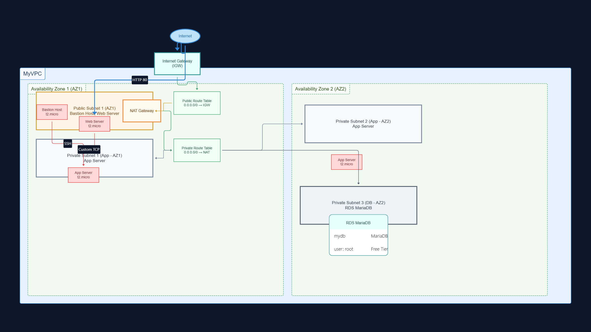

# Architecture Overview

## AWS 3-Tier Web Architecture

This project implements a highly available, secure 3-tier web architecture on AWS using Terraform Infrastructure as Code.



## Architecture Components

### Tier 1: Presentation Layer (Web Tier)
- **Web Server**: EC2 instance in public subnet
- **Load Balancing**: Direct internet access via Internet Gateway
- **Security**: Web Security Group allowing HTTP/HTTPS traffic

### Tier 2: Application Layer (App Tier)
- **App Server**: EC2 instance in private subnet
- **Processing**: Business logic and application processing
- **Security**: App Security Group allowing traffic only from Web tier

### Tier 3: Data Layer (Database Tier)
- **Database**: RDS MariaDB in private subnets
- **High Availability**: Multi-AZ deployment capability
- **Security**: Database Security Group allowing traffic only from App tier

## Network Architecture

### VPC Configuration
- **CIDR Block**: 10.0.0.0/16
- **DNS Support**: Enabled
- **DNS Hostnames**: Enabled

### Subnet Design
```
Public Subnet:    10.0.0.0/24  (AZ-1a)
Private Subnet A: 10.0.2.0/24  (AZ-1a) - App Server
Private Subnet B: 10.0.3.0/24  (AZ-1b) - Database
Private Subnet C: 10.0.4.0/24  (AZ-1b) - Database
```

### Routing
- **Public Route Table**: Routes to Internet Gateway (0.0.0.0/0)
- **Private Route Table**: Routes to NAT Gateway (0.0.0.0/0)

### Security Groups

#### Bastion Security Group
- **Inbound**: SSH (22) from specific IP range
- **Outbound**: All traffic

#### Web Security Group
- **Inbound**: HTTP (80) from anywhere (0.0.0.0/0)
- **Outbound**: All traffic

#### App Security Group
- **Inbound**: HTTP (80) from Web Security Group
- **Outbound**: All traffic

#### Database Security Group
- **Inbound**: MySQL (3306) from App Security Group
- **Outbound**: All traffic

## High Availability Features

1. **Multi-AZ Deployment**: Resources distributed across 2 availability zones
2. **NAT Gateway**: Single point for private subnet internet access
3. **Elastic IP**: Static IP for NAT Gateway
4. **DB Subnet Group**: Database can failover across AZs

## Security Features

1. **Network Segmentation**: Clear separation between tiers
2. **Security Group Rules**: Least privilege access
3. **Private Subnets**: App and DB tiers not directly accessible
4. **Bastion Host**: Secure access to private resources

## Scalability Considerations

- **Auto Scaling**: Can be added to web and app tiers
- **Load Balancer**: Can be added for high availability
- **RDS Read Replicas**: Can be added for read scaling
- **CloudFront**: Can be added for global content delivery

## Monitoring and Logging

- **CloudWatch**: Available for all EC2 and RDS instances
- **VPC Flow Logs**: Can be enabled for network monitoring
- **Application Logs**: Stored on EC2 instances

## Disaster Recovery

- **Multi-AZ**: Database can failover automatically
- **Snapshots**: RDS automated backups available
- **Infrastructure as Code**: Complete environment can be recreated